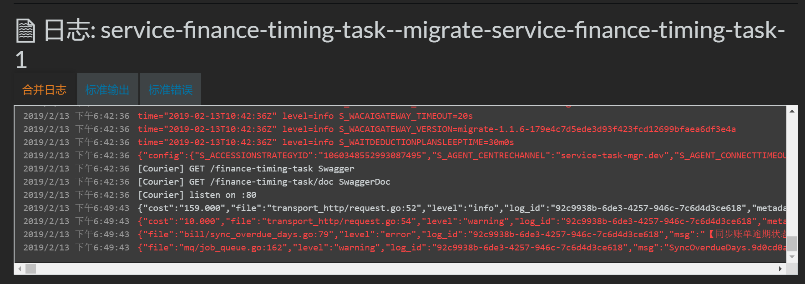
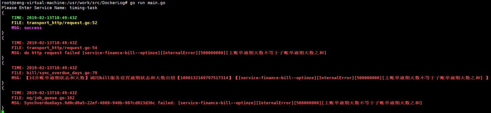

# dockerLog

    rancher在线日志，每一条日志都包含日志文本信息，文件名，行号，log_id，服务名，元数据，http方法名，工程名，url等等信息，而且所有信息都记录在一行中。
    对于软件开发人员，如果需要查看日志定位问题非常不便；且日志信息中，开发人员主要关心的是日志文本信息，文件名，行号和时间，其他无用信息过多。
    另外在微服务系统中，经常需要在不同服务之间切换查看日志，本软件提供简单命令，帮助使用者快速实现服务切换


## 前置条件
    本地运行环境支持golang和rancher cli命令

## 简单示例

### 启动
进入工程目录，执行以下命令
```
    go run main.go
```

或者自行用源码编译成可执行文件

### 使用
启动软件之后，根据提示信息输入服务名(支持部分服务名，不支持正则匹配服务名)，选择所要查看的服务日志


### 命令
以下命令都是运行过程中支持的命令

```
    s            // 切换服务名
    p            // 暂停日志打印
    r            // 重新开始打印，与p成套使用
    q            // 退出
    c            // 清屏
```

## 配置说明
config.go文件中可以对打印信息进行配置
1、预加载的服务名
2、日志字段
3、日志颜色配置

### 效果演示
#### rancher原始效果

#### 本工具效果
